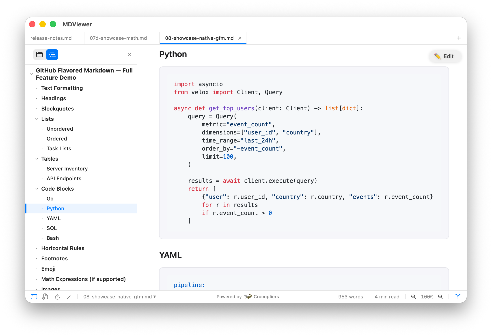
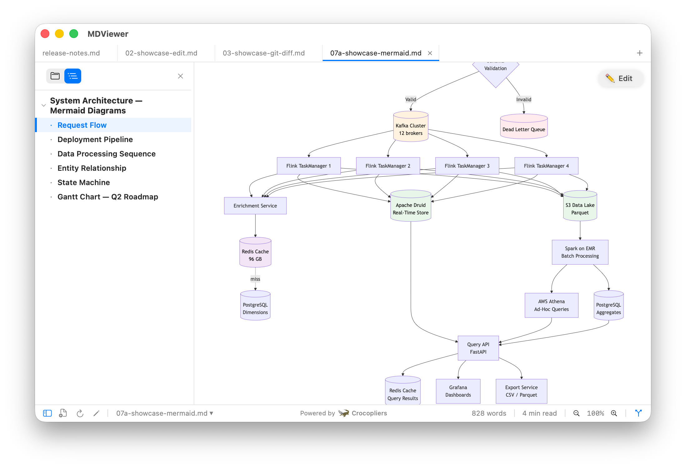
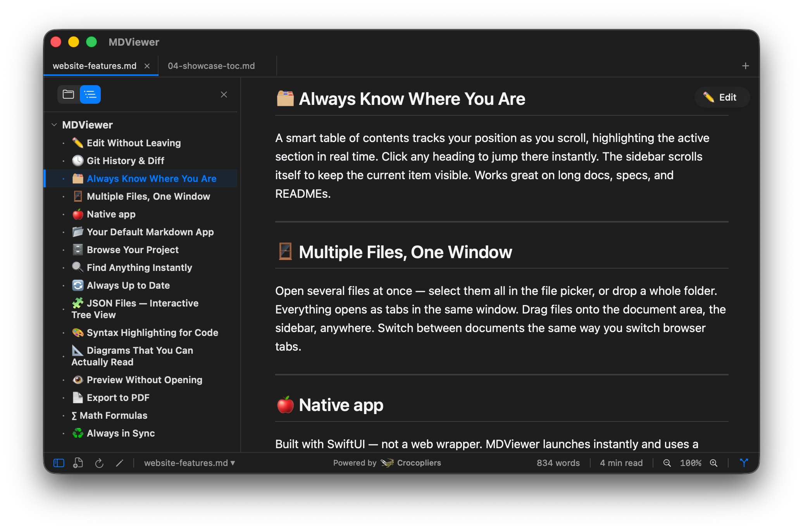

<p align="center">
  
</p>

<h1 align="center">MDViewer — Homebrew Cask</h1>

<p align="center"><strong>The fastest way to install <a href="https://getmd.ma">MDViewer</a> on your Mac.</strong></p>

[](https://getmd.ma)
[](https://apps.apple.com/app/id6767140339)
[](https://getmd.ma)
[](https://getmd.ma/pricing)

---

<p align="center">
  
</p>

## Install

```bash
brew tap crocopliers/mdviewer-homebrew
brew install --cask mdviewer
```

That's it. MDViewer lands in your Applications folder, ready to open any `.md` file.

## What is MDViewer?

A native macOS app for reading Markdown — built with SwiftUI, not Electron.

Opens instantly, uses minimal memory, and handles everything from a quick README glance to reviewing AI-generated documentation with Mermaid diagrams and Git diffs.

### Key Features

| Feature | Details |
|---|---|
| **Markdown rendering** | GitHub Flavored Markdown with syntax highlighting for 180+ languages |
| **Mermaid diagrams** | Flowcharts, sequence, ER, Gantt — rendered as interactive SVG |
| **Git history** | Built-in diff viewer with color-coded changes |
| **Inline editing** | Double-click to edit, `⌘S` to save — no app switching |
| **QuickLook** | Press Space in Finder to preview `.md`, `.json`, and `.mermaid` files |
| **PDF export** | Paper size, orientation, margins, page numbers, table of contents |
| **JSON viewer** | Collapsible tree with syntax highlighting |
| **KaTeX math** | Render LaTeX formulas inline |
| **Dark mode** | System preference + manual toggle |
| **Tabs & sidebar** | Multi-file workflows with file tree navigation |
| **Focus Mode** | Distraction-free writing (`⌘⇧F`) |

<p align="center">
  
</p>

### Built for AI Workflows

MDViewer is the go-to viewer for Markdown generated by AI tools:

- **Claude Code** — review `CLAUDE.md`, `AGENTS.md`, project plans, and generated docs
- **ChatGPT** — render exported conversations and code documentation
- **Cursor, Copilot, Windsurf** — preview AI-generated README files and specs
- **Any LLM output** — paste or open `.md` files with full rendering support

<p align="center">
  
</p>

## Pricing

| | Lite (Free) | Pro ($9.99) |
|---|---|---|
| Markdown rendering | Yes | Yes |
| Mermaid diagrams | Yes | Yes |
| Syntax highlighting | Yes | Yes |
| QuickLook preview | Yes | Yes |
| Dark mode & search | Yes | Yes |
| Tabs | Up to 3 | Unlimited |
| Inline editor | — | Yes |
| Git history & diffs | — | Yes |
| File tree sidebar | — | Yes |
| PDF export | — | Yes |
| KaTeX math | — | Yes |
| Focus Mode | — | Yes |

No ads. No tracking. No account required.

## Also Available On

- **[Mac App Store](https://apps.apple.com/app/id6767140339)** — one-click install with automatic updates
- **[Online Viewer](https://getmd.ma/viewer/)** — render Markdown in your browser, no install needed
- **[Direct Download](https://getmd.ma/download)** — `.dmg` installer from the official site

## Update

```bash
brew upgrade --cask mdviewer
```

## Uninstall

```bash
brew uninstall --cask mdviewer
```

## Links

- [Website](https://getmd.ma)
- [Changelog](https://getmd.ma/changelog)
- [Guides & Tutorials](https://getmd.ma/guides/)
- [Support](https://getmd.ma/support)
- [Privacy Policy](https://getmd.ma/privacy)

---

Made by [Crocopliers](https://www.crocopliers.com)
